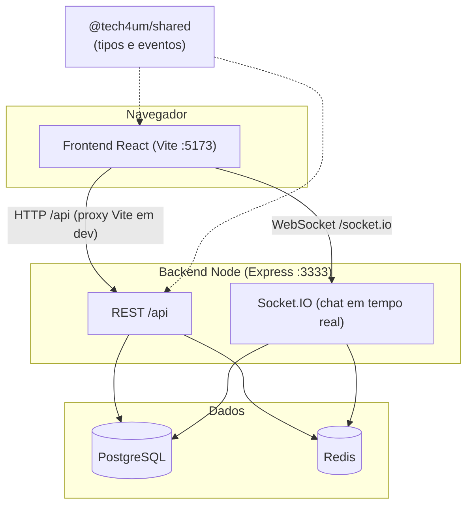

# Tech4um — Monorepo (Turborepo)


Fórum de conversas em tempo real. Monorepo gerenciado com **Turborepo** + **pnpm workspaces**.

**Produção:** https://tech4um.webcycle.com.br

## Stack

- **Backend:** Node.js, TypeScript (POO), Express, TypeORM, PostgreSQL, Socket.IO, Redis
- **Frontend:** React + Vite + TypeScript + Tailwind (design 1:1 com o Figma via Figma MCP)
- **Shared:** pacote `@tech4um/shared` com tipos, DTOs e contratos de eventos de WebSocket compartilhados entre backend e frontend
- **Monorepo:** Turborepo + pnpm
- **CI/CD:** GitHub Actions (lint, typecheck, testes com cobertura mínima, build e deploy na VPS)

## Arquitetura



| Camada | Responsabilidade |
|--------|------------------|
| **Frontend** | Dashboard de salas, chat, login, configurações de perfil |
| **REST API** | Autenticação, CRUD de fóruns, mensagens, upload de imagens |
| **Socket.IO** | Mensagens públicas/privadas, presença online, digitação, reações |
| **PostgreSQL** | Usuários, fóruns, participantes, mensagens e reações |
| **Redis** | Blacklist de tokens após logout (sessão revogada entre instâncias) |
| **Shared** | Contrato único de tipos (`User`, `Forum`, `Message`) e eventos de socket |

Em **desenvolvimento**, o Vite faz proxy de `/api` e `/socket.io` para o backend — o cookie `httpOnly` de autenticação funciona na mesma origem (`localhost:5173`).

## Estrutura do repositório

```
tech4um/
├── apps/
│   ├── backend/          # API REST + WebSocket + entidades TypeORM
│   └── frontend/         # SPA React (Vite)
├── packages/
│   └── shared/           # Tipos, DTOs e eventos de socket (fonte única)
├── deploy/               # Scripts e guia de deploy na VPS
├── scripts/dev.sh        # Sobe infra Docker + turbo dev
├── docker-compose.infra.yml   # Postgres + Redis (dev local)
├── docker-compose.yml         # Stack completa (demo/prod local)
├── docker-compose.prod.yml    # Produção na VPS
├── .github/workflows/ci.yml
├── turbo.json
└── package.json
```

> `packages/shared` evita duplicar interfaces entre backend e frontend — qualquer mudança no contrato de dados é feita em um único lugar.

## Baixar o projeto

```bash
git clone https://github.com/AndersonSilver/tech4um.git
cd tech4um
```

Se você recebeu o projeto em um `.zip`, extraia e entre na pasta `tech4um` antes dos próximos passos.

## Desenvolvimento local (recomendado)

Fluxo híbrido profissional: **Postgres + Redis no Docker/Podman** (dados persistentes) e **app local** com hot reload.

### Pré-requisitos

| Ferramenta | Versão | Verificar |
|------------|--------|-----------|
| Node.js | 20+ | `node -v` |
| pnpm | 9.x (fixado no projeto) | `pnpm -v` |
| Docker **ou** Podman + Compose | qualquer recente | `docker compose version` |

> **Importante:** os três itens acima precisam funcionar **antes** de rodar `pnpm dev`. Veja a instalação detalhada abaixo se algum comando não for encontrado.

#### Instalar o pnpm (versão 9)

O projeto exige **pnpm 9** (`packageManager` no `package.json`).

**Opção A — Corepack (recomendado, vem com o Node):**

```bash
corepack enable
corepack prepare pnpm@9.0.0 --activate
pnpm -v   # deve mostrar 9.x
```

**Opção B — npm global (Linux, sem `sudo`):**

```bash
npm install -g pnpm@9.0.0 --prefix "$HOME/.local"
export PATH="$HOME/.local/bin:$PATH"   # adicione ao ~/.bashrc para persistir
pnpm -v
```

**Opção C — npm global (com permissão de administrador):**

```bash
npm install -g pnpm@9.0.0
```

#### Docker ou Podman (infraestrutura)

O script `pnpm dev` usa `docker compose` para subir Postgres e Redis.

**Docker Engine (Ubuntu, Debian, etc.):**

```bash
# Instale Docker + plugin Compose conforme a documentação oficial
docker compose version
```

**Fedora / RHEL (Podman — comum vir pré-instalado):**

O Podman sozinho **não** expõe o comando `docker`. Instale o emulador e o plugin de Compose:

```bash
sudo dnf install -y podman-docker docker-compose
systemctl --user enable --now podman.socket
docker compose version   # deve responder (mensagem "Emulate Docker CLI using podman" é normal)
```

> Após reiniciar o PC no Fedora, se o compose falhar com `podman.sock: no such file`, rode:
> `systemctl --user start podman.socket`

### 1. Instalar dependências

```bash
pnpm install
```

### 2. Configurar variáveis de ambiente (obrigatório)

Copie **os três** arquivos — o `pnpm dev` só cria o `.env` da raiz automaticamente; **backend e frontend precisam ser copiados manualmente**:

```bash
cp .env.example .env
cp apps/backend/.env.example apps/backend/.env
cp apps/frontend/.env.example apps/frontend/.env
```

**Mínimo para rodar em dev:** gere um `JWT_SECRET` forte no backend:

```bash
# Linux/macOS — cole o resultado em JWT_SECRET dentro de apps/backend/.env
openssl rand -hex 32
```

| Variável | Obrigatório em dev? | Observação |
|----------|---------------------|------------|
| `JWT_SECRET` | **Sim** | mínimo 16 caracteres; use `openssl rand -hex 32` |
| `DB_PASSWORD` / `REDIS_PASSWORD` | Sim (defaults ok) | **mesmo valor** na raiz (`.env`) **e** em `apps/backend/.env` — ver [Credenciais do banco](#credenciais-do-banco-e-redis) |
| Google OAuth, reCAPTCHA, SMTP | Não | opcionais para explorar dashboard e chat demo; necessários para cadastro/login real e criar fórum |

> `DB_PASSWORD` e `REDIS_PASSWORD` na raiz (`.env`) devem bater com `apps/backend/.env`.

#### Credenciais do banco e Redis

Pode usar **outra senha** que não seja `postgres` — o importante é que ela seja **igual nos dois lugares**:

| Arquivo | Variável | Exemplo |
|---------|----------|---------|
| `.env` (raiz) | `DB_PASSWORD` | `minha_senha_123` |
| `apps/backend/.env` | `DB_PASSWORD` | `minha_senha_123` (igual) |
| `.env` (raiz) | `REDIS_PASSWORD` | `redis_dev_local` |
| `apps/backend/.env` | `REDIS_URL` | `redis://:redis_dev_local@localhost:6379` (senha dentro da URL) |

**Se as senhas não baterem**, o backend falha com erro de autenticação, por exemplo:
`password authentication failed for user "postgres"` ou `connect ECONNREFUSED`.

**Atenção ao trocar senha depois:** o Postgres grava a senha no **volume Docker** na primeira subida. Se você já rodou `pnpm dev` antes com `postgres` e depois mudar só o `.env`, o container continua com a senha antiga. Opções:

1. **Manter a senha antiga** nos dois `.env` (mais simples), ou
2. **Recriar o volume** (apaga todos os dados locais):
   ```bash
   pnpm dev:infra:down
   docker volume rm tech4um_postgres_data tech4um_redis_data
   # ajuste DB_PASSWORD / REDIS_PASSWORD nos dois .env com o mesmo valor novo
   pnpm dev
   ```

**Resumo para quem está começando:** copie os `.env.example` sem mudar nada (só defina `JWT_SECRET`) — as senhas padrão já vêm alinhadas e as salas aparecem sozinhas no primeiro `pnpm dev`.

### 3. Subir tudo com um comando

```bash
pnpm dev
```

Isso executa, nesta ordem:

1. **Postgres** em `localhost:5433` (volume `tech4um_postgres_data`)
2. **Redis** em `localhost:6379` (com senha; volume `tech4um_redis_data`)
3. **Frontend** em http://localhost:5173
4. **Backend** em http://localhost:3333

O TypeORM cria as tabelas automaticamente em desenvolvimento (`synchronize: true`).

### Salas de demonstração (primeira vez)

**Não precisa rodar `pnpm seed` na primeira vez.** Basta `pnpm dev` com banco vazio: o backend cria sozinho as 15 salas + usuário demo ao subir.

O `pnpm seed` só é necessário se você **já tem salas** e quer **apagar tudo e recriar** do zero.

O projeto já vem com **15 salas de tecnologia** pré-definidas (IA, Cloud, DevOps, React, etc.).

| Situação | O que acontece |
|----------|----------------|
| **Primeiro `pnpm dev` com banco vazio** | O backend cria automaticamente as 15 salas + usuário demo |
| **Banco já tem salas** | O seed automático **não roda de novo** (evita duplicar) |
| **Quer recriar as salas do zero** | Rode `pnpm seed` (apaga salas, mensagens e participantes existentes) |
| **Quer desativar o seed** | `SEED_DEMO_DATA=false` em `apps/backend/.env` |

**Regras do seed automático** (`DemoDataSeeder`):

- **Desenvolvimento:** ativo por padrão (`SEED_DEMO_DATA` omitido ou diferente de `false`)
- **Produção:** desativado por padrão; use `SEED_DEMO_DATA=true` no `.env` da VPS se quiser popular na primeira subida

**Conta demo** (para entrar no chat e enviar mensagens):

| Campo | Valor |
|-------|-------|
| E-mail | `demo@tech4um.local` |
| Senha | `Demo1234!` |

> **Listar salas** no dashboard é público (não exige login). **Entrar no chat**, enviar mensagens ou criar fórum exige autenticação.

**Fluxo típico na primeira máquina:**

```bash
git clone https://github.com/AndersonSilver/tech4um.git
cd tech4um
pnpm install
cp .env.example .env
cp apps/backend/.env.example apps/backend/.env
cp apps/frontend/.env.example apps/frontend/.env
# defina JWT_SECRET em apps/backend/.env (openssl rand -hex 32)
pnpm dev
# abra http://localhost:5173 — as salas já aparecem no dashboard
# faça login com demo@tech4um.local para entrar em uma sala
```

### Comandos úteis

| Comando | Descrição |
|---------|-----------|
| `pnpm dev` | Infra Docker + app |
| `pnpm dev:app` | Só frontend/backend (infra já rodando) |
| `pnpm dev:infra` | Só Postgres + Redis |
| `pnpm dev:infra:down` | Para Postgres + Redis |
| `pnpm seed` | **Opcional** — só para recriar salas demo após apagar manualmente ou em testes (não é passo da 1ª instalação) |
| `pnpm db:shell` | Abre `psql` no Postgres do container |
| `pnpm test` | Roda todos os testes (backend + frontend + shared) |
| `pnpm test:coverage` | Testes + relatório de cobertura + validação de thresholds mínimos |

> **Persistência:** nunca rode `docker compose down -v` — o flag `-v` **apaga** os volumes e todo o banco.

### Solução de problemas (setup)

| Erro | Causa | Solução |
|------|-------|---------|
| `pnpm: comando não encontrado` | pnpm não instalado ou fora do `PATH` | Siga [Instalar o pnpm](#instalar-o-pnpm-versão-9) acima |
| `Docker não encontrado` | Falta Docker ou emulador no Fedora | `sudo dnf install -y podman-docker docker-compose` |
| `podman.sock: no such file` | Socket do Podman inativo (Fedora) | `systemctl --user enable --now podman.socket` |
| `Variáveis de ambiente obrigatórias ausentes: JWT_SECRET` | `apps/backend/.env` não foi criado | `cp apps/backend/.env.example apps/backend/.env` e defina `JWT_SECRET` |
| `connect ECONNREFUSED 127.0.0.1:5433` | Postgres não está rodando | `pnpm dev:infra` ou `pnpm dev` (sobe a infra antes do app) |
| `password authentication failed for user "postgres"` | `DB_PASSWORD` diferente entre `.env` da raiz e `apps/backend/.env`, ou volume criado com senha antiga | Alinhe os dois arquivos; se mudou senha depois, recrie o volume (ver [Credenciais](#credenciais-do-banco-e-redis)) |
| `NOAUTH` / erro no Redis | `REDIS_PASSWORD` não bate com a senha em `REDIS_URL` | Use a mesma senha na raiz e em `redis://:SENHA@localhost:6379` |
| `permission denied` ao instalar pnpm global | npm tentou escrever em `/usr/local` sem sudo | Use `--prefix "$HOME/.local"` (opção B acima) |

**Checklist rápido antes de avaliar:**

```bash
node -v          # >= 20
pnpm -v          # 9.x
docker compose version
test -f apps/backend/.env && test -f apps/frontend/.env && echo "env OK"
pnpm dev
```

### Login com Google

1. Crie um OAuth Client ID (tipo "Web application") em https://console.cloud.google.com/apis/credentials
2. Adicione `http://localhost:5173` em "Authorized JavaScript origins"
3. Copie o Client ID para `GOOGLE_CLIENT_ID` (backend) e `VITE_GOOGLE_CLIENT_ID` (frontend)

## Stack completa com Docker (produção / demo)

```bash
# .env na raiz com JWT_SECRET, DB_PASSWORD, REDIS_PASSWORD, etc.
docker compose up -d --build
```

- Frontend: http://localhost:5173
- Backend: http://localhost:3333
- Postgres e Redis **sem portas expostas** na rede interna do compose

## Como rodar localmente sem Docker (legado)

<details>
<summary>Clique para expandir — não recomendado para o time</summary>

### Pré-requisitos adicionais

- PostgreSQL e Redis instalados na máquina

### Passos

```bash
pnpm install
cp apps/backend/.env.example apps/backend/.env
cp apps/frontend/.env.example apps/frontend/.env
createdb tech4um
pnpm dev:app
```

</details>

## Build de produção
```bash
pnpm build
```

## Design

O frontend foi implementado a partir do protótipo oficial no Figma, extraindo cores, tipografia (Poppins/Roboto), espaçamentos e componentes diretamente via Figma MCP, garantindo fidelidade visual ao design.

## Testes automatizados

O monorepo tem **244 testes** em **65 suites**, distribuídos por pacote:

| Pacote | Runner | Suites | Testes |
|--------|--------|--------|--------|
| `@tech4um/backend` | **Jest** | 34 | 136 |
| `@tech4um/frontend` | **Vitest** | 30 | 105 |
| `@tech4um/shared` | **Vitest** | 1 | 3 |

> O frontend usa **Vitest** (não Jest), com API compatível (`describe`, `it`, `expect`).

### Comandos

```bash
# Todos os pacotes em paralelo (Turborepo)
pnpm test
pnpm test:coverage   # inclui validação de cobertura mínima

# Por pacote
pnpm --filter @tech4um/backend test
pnpm --filter @tech4um/backend test:coverage

pnpm --filter @tech4um/frontend test
pnpm --filter @tech4um/frontend test:coverage

pnpm --filter @tech4um/shared test
pnpm --filter @tech4um/shared test:coverage
```

Relatórios gerados em `coverage/` de cada pacote (ignorados pelo git).

### Cobertura mínima (thresholds)

O CI falha se a cobertura ficar abaixo destes limites:

| Pacote | Lines | Statements | Branches | Functions |
|--------|-------|------------|----------|-----------|
| Backend | 70% | 70% | 50% | 55% |
| Frontend | 75% | 75% | 75% | 55% |
| Shared | 95% | 95% | 90% | 90% |

### O que está coberto

**Backend:** controllers, services, utils, middlewares, repositories, sockets (`ChatSocketHandler`), entidades com lógica de domínio.

**Frontend:** componentes, páginas, contexts (`AuthContext`, `SocketContext`), services (`api`, `googleIdentity`, `recaptcha`), utils.

**Shared:** contratos (`PRESET_AVATARS`, `SOCKET_EVENTS`, `QUICK_REACTION_EMOJIS`).

**Fora do escopo unitário** (cobertura via integração/E2E, se necessário no futuro): `server.ts`, `config/*`, `routes/*`, scripts CLI (`reset-forums.ts`).

### CI e bloqueio de merge

O workflow [`.github/workflows/ci.yml`](.github/workflows/ci.yml) executa `pnpm test:coverage` em todo push/PR para `main`. Se algum teste falhar ou a cobertura cair abaixo do threshold, o job **Lint, Typecheck, Test & Build** falha.

Para **bloquear merge** de PRs sem CI verde:

1. Repositório → **Settings** → **Branches**
2. Regra de proteção em `main` → **Require status checks to pass before merging**
3. Marque o check **Lint, Typecheck, Test & Build**

O CI também publica o artefato `coverage-reports` (`lcov.info` por pacote) para inspeção nos logs do GitHub Actions.

## Deploy

Stack de produção isolada (`docker-compose.prod.yml`) + CI/CD via GitHub Actions.

**Guia completo:** [deploy/HOSTINGER.md](deploy/HOSTINGER.md)

### Resumo rápido

1. Na VPS: clone em `/opt/tech4um`, copie `.env.production.example` → `.env`
2. `./deploy/remote-deploy.sh` (primeiro deploy manual)
3. Nginx no host → `127.0.0.1:8173` (front) e `8174` (API + WebSocket)
4. GitHub Secrets: `VPS_HOST`, `VPS_USER`, `VPS_SSH_KEY`
5. Push na `main` → CI passa → deploy automático

### Deploy gerenciado (alternativa)
- **Backend + Postgres + Redis:** Railway/Render usando `apps/backend/Dockerfile`.
- **Frontend:** Vercel/Netlify (build estático) ou `apps/frontend/Dockerfile` (Nginx).


## Segurança

Após uma avaliação interna (simulando o que um pentest básico cobriria), os seguintes pontos foram endurecidos:

### 🔴 Críticos corrigidos
- **Sem segredo fraco/padrão em lugar nenhum** — `JWT_SECRET` e a senha do Postgres não têm mais valor default no `docker-compose.yml`; o compose falha explicitamente (`:?mensagem`) se não forem definidos via variável de ambiente. `TokenService` também valida em runtime que o secret tem no mínimo 16 caracteres.
- **Rate limiting** em `/auth/login`, `/auth/register`, `/auth/google` (10 tentativas / 15 min por IP) e um limite geral na API (120 req/min). Mitiga brute-force e DoS simples.
- **Token de autenticação migrado de `localStorage` para cookie `httpOnly` + `Secure` (produção) + `SameSite=Strict`** — JavaScript não consegue mais ler o token, mesmo com XSS. `SameSite=Strict` também mitiga CSRF na grande maioria dos cenários.
- **Mensagem de erro de cadastro anti-enumeração** — não revela mais se um e-mail específico já está cadastrado (username continua revelando, por ser um identificador público).
- **`synchronize: true` do TypeORM agora é condicionado a `NODE_ENV !== "production"`** — nunca mais altera schema de produção sem migration.

### 🟠 Médios corrigidos
- **Helmet** habilitado (headers de segurança padrão: HSTS, X-Content-Type-Options, remoção de `X-Powered-By` etc.).
- **Limite de tamanho de payload** (`express.json({ limit: "16mb" })`) — suporta upload de imagem em base64 no chat, com margem para o JSON completo.
- **Revogação de sessão (logout real)** — `POST /auth/logout` adiciona o `jti` do token a uma blacklist em memória, verificada em toda requisição autenticada e também nos WebSockets. Um token roubado/antigo não funciona mais após logout.
- **Tempo de vida do token reduzido** de 1 dia para 2h por padrão (configurável via `JWT_EXPIRES_IN`).
- **CORS estrito** — sem fallback para `*`; em produção, a inicialização falha se `CORS_ORIGIN` não estiver definido.
- **Política de senha** — mínimo 8 caracteres, exigindo maiúscula, minúscula e número.
- **Revalidação periódica de sessão no WebSocket** (a cada 5 min) — desconecta o socket se o token foi revogado nesse meio tempo.

### 🟡 Baixos corrigidos
- **`pnpm audit --audit-level=high`** adicionado ao pipeline de CI (não bloqueia o build, mas reporta no log).
- **Validação e rate limiting de mensagens no WebSocket** — conteúdo vazio/maior que 2000 caracteres é rejeitado; no máximo 20 mensagens por 10s por conexão.
- **Mensagem privada agora valida que o destinatário realmente participa do fórum** antes de permitir o envio (evita enviar "mensagem privada" para qualquer `userId` arbitrário fora de contexto).

### Implementado nesta rodada (antes listado como limitação)
- **CAPTCHA anti-bot** — Google reCAPTCHA v3 no cadastro e login (token invisível no frontend, verificação via `siteverify` no backend).
- **Verificação de e-mail** — no cadastro é enviado um link (token aleatório de 32 bytes, do qual guardamos apenas o hash SHA-256, com expiração de 24h) via SMTP/`nodemailer`. Criar fórum exige e-mail verificado. Há reenvio de link com resposta genérica anti-enumeração.
- **Blacklist de tokens distribuída** — migrada de memória para **Redis** com TTL igual ao tempo restante do token. Um logout agora se propaga entre todas as instâncias do backend.

### Limitações que permanecem
- **Verificação de e-mail não é obrigatória para login** — apenas para ações sensíveis (criar fórum). Decisão de produto para não travar o acesso por um e-mail que pode não ter chegado.
- **WAF / proteção de borda** — fica a cargo da infraestrutura (ex.: Cloudflare na frente do VPS).

## Autenticação

- Login/cadastro com e-mail e senha (hash com bcrypt, política de senha forte)
- Login social com Google (Google Identity Services no frontend + verificação do `idToken` com `google-auth-library` no backend)
- Usuários criados via Google não possuem senha até que decidam definir uma (campo `passwordHash` é opcional na entidade `User`)
- Sessão via cookie `httpOnly` (não acessível via JavaScript) com revogação real no logout

